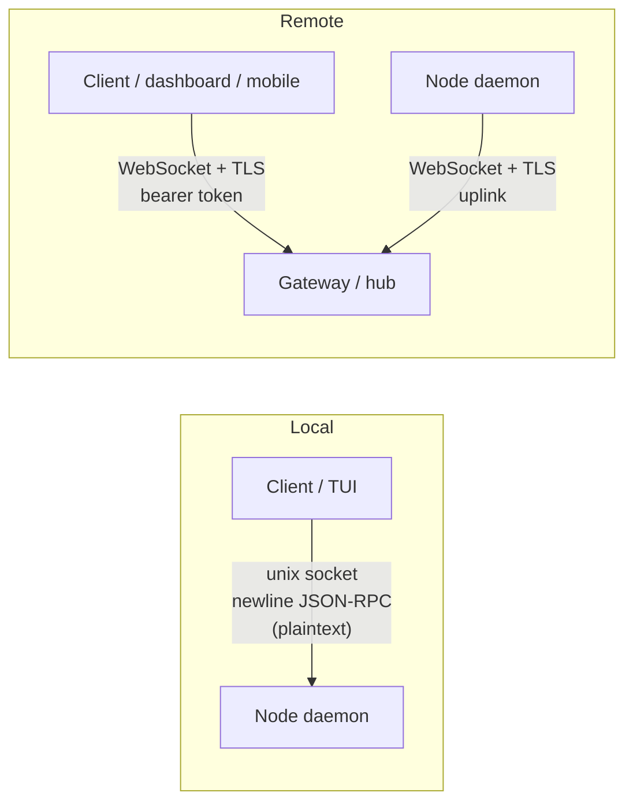
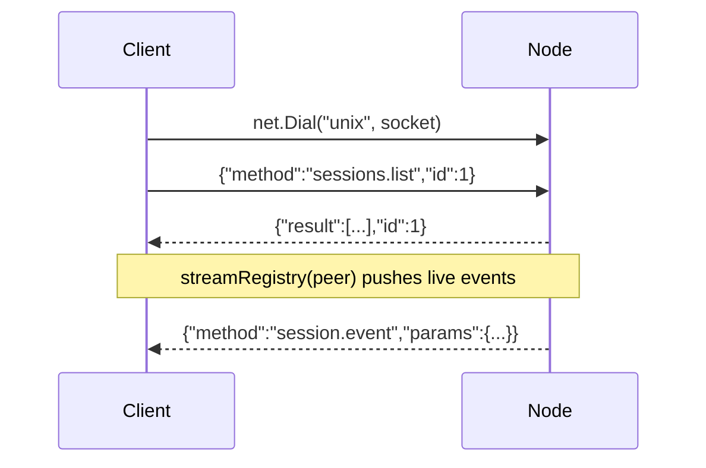
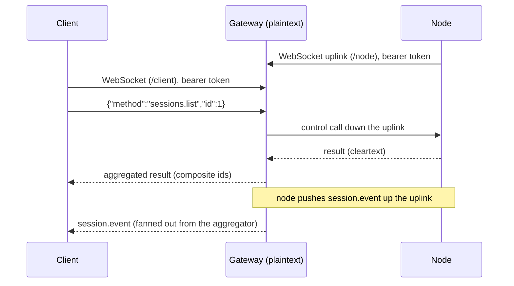
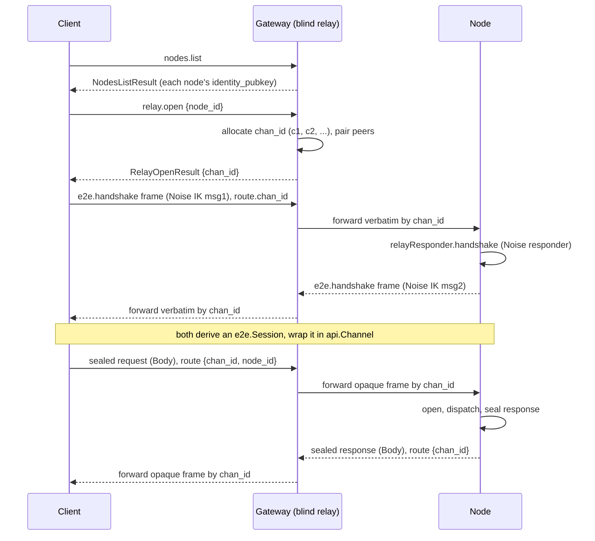

# Wire Protocol

Argus uses one JSON-RPC 2.0 protocol. The protocol runs in two modes:

- **Plaintext**: the payload travels in cleartext. The transport can still be encrypted at the hop (unix socket permissions, or TLS on the WebSocket).
- **E2EE** (end-to-end encrypted): the payload is sealed with Noise. The gateway relays opaque frames and never sees cleartext.

There is one protocol, not two. The message envelope, the method catalog, and the parameter and result types are the same in both modes. E2EE is a sealing layer that wraps the same envelope. It is a decorator over the same transport, not a separate protocol.

[[toc]]

## Roles

| Role | Description |
|---|---|
| **Node** (daemon) | Runs on a machine with agent sessions. Serves the protocol over a local unix socket, and dials a gateway uplink for remote access. |
| **Gateway** (hub) | Aggregates many nodes. Serves clients over WebSocket. In E2EE mode the gateway is a blind relay. |
| **Client** (TUI, dashboard, mobile) | Consumes the protocol. Reads session state and drives sessions. |

## Transports

The protocol frame is **newline-delimited JSON**. The framing is identical on every transport.

| Transport | Use | Entry point |
|---|---|---|
| Unix socket | Local client to node | `api.Dial(socket)` → `net.Dial("unix", socket)` (`internal/api/client.go`) |
| WebSocket | Remote client to gateway, and node uplink to gateway | `internal/api/ws.go` |

The unix socket path defaults to the runtime directory plus `argus.sock` (`internal/config/config.go`). The node creates the parent directory at mode `0700`, removes a stale socket, then listens (`internal/node/node.go`).

The WebSocket transport uses these endpoint paths (`internal/gateway/server.go`):

| Path | Purpose |
|---|---|
| `/node` | Node uplink endpoint |
| `/client` | Client (dashboard, TUI, mobile) endpoint |

WebSocket details:

- Message type: `websocket.MessageText`. The text frame holds newline-delimited JSON-RPC. The framing matches the unix transport.
- Read limit: `16 MiB` (`wsReadLimit`).
- Authentication: the `Authorization: Bearer <token>` header. Browsers cannot set custom headers on a WebSocket handshake, so the server also reads a `token` query parameter (`BearerToken`, `internal/api/ws.go`).
- On a failed authorization the server answers `401 unauthorized`. The dial side raises `DialAuthError`.
- TLS is applied by the enclosing `http.Server`. TLS is hop encryption. TLS is separate from E2EE.

## Architecture

The connection topology is the same in both modes. The difference is what the gateway can read.



## Message envelope

One struct carries every request, response, and notification, on every transport and in both modes (`internal/api/protocol.go`).

```go
type message struct {
	JSONRPC string           `json:"jsonrpc"`
	ID      *json.RawMessage `json:"id,omitempty"`
	Method  string           `json:"method,omitempty"`
	Route   *RouteHeader     `json:"route,omitempty"`
	Body    json.RawMessage  `json:"body,omitempty"`
	Params  json.RawMessage  `json:"params,omitempty"`
	Result  json.RawMessage  `json:"result,omitempty"`
	Error   *RPCError        `json:"error,omitempty"`
}
```

`jsonrpc` is always `"2.0"`. The frame kind is decided by which fields are set:

| Predicate | Condition | Meaning |
|---|---|---|
| `isRequest()` | `Method != "" && ID != nil` | A call that expects a response. |
| `isNotification()` | `Method != "" && ID == nil` | A server push. No response. |
| `isRelay()` | `Route != nil` | An E2EE frame for the blind gateway to route. |

The two payload shapes:

- **Plaintext path**: `Params`, `Result`, and `Error` hold cleartext JSON. `Route` and `Body` are nil.
- **E2EE path**: `Route` holds cleartext routing metadata. `Body` holds the sealed payload. `Params`, `Result`, and `Error` are nil on the wire.

### Routing header

The routing header is cleartext. It exists only on relayed (E2EE) frames. The blind gateway reads it to route the frame. The gateway never reads `Body`.

```go
type RouteHeader struct {
	ChanID string `json:"chan_id"`           // client<->node E2E channel; the routing key
	NodeID string `json:"node_id,omitempty"` // target node (set on the channel-open request)
	SubID  string `json:"sub_id,omitempty"`  // streaming handle; the client demuxes on it
	TermID string `json:"term_id,omitempty"` // terminal handle; the client demuxes on it
}
```

`ChanID` is the routing key at the gateway. One channel serves exactly one client-node pair. `SubID` and `TermID` are demultiplexed by the client after it decrypts the frame, not by the gateway.

### Errors

```go
type RPCError struct {
	Code    int    `json:"code"`
	Message string `json:"message"`
}
```

| Code | Constant | Meaning |
|---|---|---|
| `-32700` | `CodeParseError` | The frame is not valid JSON. |
| `-32600` | `CodeInvalidRequest` | The request or its params are invalid. |
| `-32601` | `CodeMethodNotFound` | The method is unknown. |
| `-32603` | `CodeInternalError` | An internal error. |
| `410` | `CodePushGone` | A `push.test` hit a permanently dead target. |

In E2EE mode the response result or error is sealed inside `Body`. The node error detail never appears in cleartext. The sealed inner shape is:

```go
type sealedResponse struct {
	Result json.RawMessage `json:"result,omitempty"`
	Error  *RPCError       `json:"error,omitempty"`
}
```

## Mode selection

The mode is a configuration flag, not a per-connection negotiation. The whole fleet must opt in. The flag is `e2ee.enabled` (`internal/config/config.go`):

```go
type E2EEConfig struct {
	Enabled bool
}
```

The flag is read at three places:

| Role | Location | Effect |
|---|---|---|
| Client | `cmd/argus/embed.go` (`connect`) | If a gateway URL is set and `E2EE.Enabled`, build an E2EE client. Otherwise build a plaintext client. |
| Gateway | `internal/gateway/server.go` (`NewServer(..., blind bool)`) | `blind == true` selects the blind relay path. `blind == false` selects the plaintext path. |
| Node | `cmd/argus/embed.go` / `cmd/argus/start.go` (`SetE2EE`) | Activates the relay responder. |

The client chooses the concrete client type:

```go
if gatewayURL != "" && cfg.E2EE.Enabled {
    if len(head) > 0 { // locked mode: pinned trust-log genesis
        c, err := client.NewReconnectingE2EClientLocked(ctx, dial, head, static, ...)
    }
    c, err := client.NewReconnectingE2EClient(ctx, dial) // TOFU E2E
}
c, err := api.NewReconnectingClient(ctx, dial) // plaintext: unix socket, or gateway with E2EE off
```

The only per-connection negotiation is the Noise handshake inside an E2EE channel. The plaintext-versus-E2EE choice itself is never negotiated.

## Plaintext mode

### Local (unix socket)

The client dials the node socket directly. The node's `api.Server` accepts the socket. Each request runs with the serving `Peer` as its notifier. Handler pushes go straight out over the same socket.



### Remote (through the gateway)

In plaintext mode the gateway is **not** blind. It reads `params`. It keeps its own routing tables for subscriptions (`subs`) and terminals (`terms`). It rewrites session ids to composite ids so a client can tell nodes apart.



## E2EE mode

In E2EE mode the client opens a Noise channel to each node through the blind gateway. The gateway allocates a channel id and pairs the two peers. The client and the node run a Noise handshake. All later traffic is sealed. The gateway forwards the sealed frames by channel id and never reads the payload.



### Cryptography

The Noise primitive lives in `internal/e2e/e2e.go`. No other package imports the Noise library directly.

- **Suite**: `noise.DH25519`, `noise.CipherChaChaPoly`, `noise.HashBLAKE2s`. That is Curve25519, ChaCha20-Poly1305, and BLAKE2s.
- **Pattern**: Noise IK. The handshake is two messages. Message 1 goes from the initiator (client) to the responder (node). Message 2 goes back. IK transmits the initiator static key in message 1, so the responder learns the authenticated client static key.
- **Keys**: Curve25519 key pairs. The private key and the public key are each 32 bytes. The identity is persisted at mode `0600` under a `0700` directory (`LoadOrCreateIdentity`). A stable identity lets a locked network authorize the device key once.

### Channel sealing

`api.Channel` (`internal/api/channel.go`) wraps one `e2e.Session` and seals or opens JSON-RPC payloads.

- The prologue binds a channel to a node and a channel id. The client and the node must derive it identically:

  ```go
  func ChannelPrologue(nodeID, chanID string) []byte {
      return []byte("argus-e2e/v1|" + nodeID + "|" + chanID)
  }
  ```

- `Body` encoding: the sealed bytes are standard base64, then JSON-marshaled as a string. So `Body` is a JSON string of base64 of Noise-sealed bytes.
- The handshake frame carries the raw Noise handshake bytes, base64 in `Body`. The handshake bytes are **not** sealed, because no session exists yet. The method is `e2e.handshake`.
- Frame builders:
  - `SealRequestFrame`: cleartext `Method`, `ID`, and `Route{ChanID, NodeID}`. Sealed params in `Body`.
  - `SealResponseFrame`: `Route{ChanID}` only. Sealed result or error in `Body`.
  - `SealNotificationFrame`: the caller can set `SubID` or `TermID` on the route. `ChanID` is forced. Sealed params in `Body`.

### Record framing

`Session.Seal` and `Session.Open` chunk the plaintext into length-prefixed Noise records (`internal/e2e/e2e.go`):

- `maxChunk = noise.MaxMsgLen - 16`. That is the 65535-byte record ceiling minus the 16-byte Poly1305 tag.
- Each record is a 2-byte big-endian length prefix, then the ciphertext.
- Each record is encrypted with associated data `recordAD(index, final)`. The associated data is 5 bytes: a 4-byte big-endian record index, then 1 byte that is `1` for the final record or `0` otherwise.
- The associated data binds each record to its position. A truncated, empty, or replaced blob fails to open. The cleartext length prefixes are not authenticated on their own.
- An empty message yields exactly one final record with empty plaintext.

Records must be processed in order per direction. Noise nonces are implicit. A dropped or reordered sealed frame desynchronizes the cipher.

## Notifications

Notification production is identical in both modes. Every server push comes from a node handler (or the registry loop) that calls `Notify(method, params)` on an `api.Notifier` taken from the request context (`internal/api/server.go`).

```go
type Notifier interface {
	Notify(method string, params any) error
}
```

Only the concrete notifier bound to the context changes:

| Mode | Notifier | Behavior |
|---|---|---|
| Plaintext | `*api.Peer` (`Peer.Notify`) | Writes a cleartext notification frame. |
| E2EE | `channelNotifier` (`internal/node/responder.go`) | Seals the payload into `Body` with `SealNotificationFrame`. |

The same `streamRegistry`, the same transcript poller (`pollTranscript`), and the same terminal pump (`pumpTerm`) run in both modes. They touch only the abstract notifier. The handlers stream over E2EE with no handler changes.

What differs between the modes:

| Aspect | Plaintext | E2EE |
|---|---|---|
| Gateway role | Reads params. Owns `subs` and `terms` routing tables. | Blind. Forwards opaque frames by `chan_id`. |
| Streaming demux at the gateway | By `sub_id` and `term_id`. | By `chan_id` only. |
| Composite id stamping | At the gateway (`withOrigin`, `compositingNotifier`). | At the client (`stampEvent`, `stampTasksChanged`). |
| Node-loss synthesis | At the gateway aggregator. | At the client, from `node.event` (`loseNode`, 30 s grace). |
| Drop granularity | Individual notifications drop. Terminal overflow drops the client connection. | A sealed frame cannot drop alone (it would desync the AEAD). Queue overflow tears down the whole channel. |

`node.event` is mode-specific. In E2EE mode it is the only push the gateway itself originates. It drives the client channel lifecycle: `added` or `online` opens a channel, `offline` or `removed` drops it and synthesizes session removals, `beacon` triggers the trust log. In plaintext mode there is no client-managed channel lifecycle.

Both modes end at the same client endpoint: `Events() <-chan api.Notification`, consumed by the TUI and dispatched in `applyEvent`.

## Method catalog

Every method uses one of these constant string values. Local-only methods are marked. The gateway rejects every `lock.*` method over a remote link; `lock.*` is local unix-socket only.

### Ping, health, server, nodes

| Method | Value | Params | Result |
|---|---|---|---|
| `MethodPing` | `ping` | none | nil |
| `MethodServerInfo` | `server.info` | none | `ServerInfo` |
| `MethodNodeIdentify` | `node.identify` | none | `IdentifyResult` |
| `MethodNodesList` | `nodes.list` | none | `NodesListResult` |
| `MethodNodeEvent` | `node.event` | notification | `NodeEvent` |

```go
type ServerInfo struct {
	Version string     `json:"version"`
	Nodes   []NodeInfo `json:"nodes"`
}

type NodeInfo struct {
	ID           string           `json:"id"`
	Label        string           `json:"label"`
	Version      string           `json:"version"`
	Capabilities NodeCapabilities `json:"capabilities"`
}

type NodeCapabilities struct {
	SpawnSession bool `json:"spawn_session"`
}

type IdentifyResult struct {
	ID             string           `json:"id"`
	Label          string           `json:"label"`
	Version        string           `json:"version"`
	Capabilities   NodeCapabilities `json:"capabilities"`
	IdentityPubKey string           `json:"identity_pubkey,omitempty"` // base64 Curve25519 static public (E2E)
	SignerPubKey   string           `json:"signer_pubkey,omitempty"`   // base64 Ed25519 signer public
	BeaconPubKey   string           `json:"beacon_pubkey,omitempty"`   // base64 Ed25519 beacon public
	Beacon         *Beacon          `json:"beacon,omitempty"`
}

type NodeDescriptor struct {
	ID             string           `json:"id"`
	Label          string           `json:"label"`
	Version        string           `json:"version"`
	Capabilities   NodeCapabilities `json:"capabilities"`
	IdentityPubKey string           `json:"identity_pubkey,omitempty"`
	SignerPubKey   string           `json:"signer_pubkey,omitempty"`
	BeaconPubKey   string           `json:"beacon_pubkey,omitempty"`
	Beacon         *Beacon          `json:"beacon,omitempty"`
	Online         bool             `json:"online"`
}

type NodesListResult struct {
	Nodes []NodeDescriptor `json:"nodes"`
}

const (
	NodeEventAdded   = "added"
	NodeEventOnline  = "online"
	NodeEventOffline = "offline"
	NodeEventRemoved = "removed"
	NodeEventBeacon  = "beacon"
)

type NodeEvent struct {
	Type string         `json:"type"` // added | online | offline | removed
	Node NodeDescriptor `json:"node"`
}
```

### Sessions (live)

| Method | Value | Params | Result |
|---|---|---|---|
| `MethodSessionsList` | `sessions.list` | none | `[]session.Session` |
| `MethodSessionsRefresh` | `sessions.refresh` | none | `[]session.Session` |
| `MethodSessionEvent` | `session.event` | notification | `registry.Event` |
| `MethodSessionTranscriptView` | `sessions.transcriptView` | `TranscriptParams` | `transcript.TranscriptView` |
| `MethodSessionToolDetail` | `sessions.toolDetail` | `ToolDetailParams` | `ToolDetail` |
| `MethodSessionCapture` | `sessions.capture` | `SessionRef` | `CaptureResult` |
| `MethodSessionInput` | `sessions.input` | `InputParams` | nil |
| `MethodSessionKey` | `sessions.key` | `KeyParams` | nil |
| `MethodSessionRespond` | `sessions.respond` | `RespondParams` | nil |
| `MethodSessionSpawn` | `sessions.spawn` | `SpawnParams` | `SpawnResult` |
| `MethodSessionResume` | `sessions.resume` | `ResumeParams` | `ResumeResult` |
| `MethodSessionKill` | `sessions.kill` | `SessionRef` | nil |
| `MethodSessionFocus` | `sessions.focus` | `SessionRef` | nil |
| `MethodAgentsList` | `agents.list` | `AgentsListParams` | `AgentsListResult` |
| `MethodSessionTasks` | `sessions.tasks` | `SessionRef` | `TasksResult` |

```go
type SessionRef struct {
	SessionID string `json:"session_id"`
}

type TranscriptParams = SessionRef

type ToolDetailParams struct {
	SessionID string `json:"session_id"`
	AgentID   string `json:"agent_id,omitempty"`
	ToolID    string `json:"tool_id"`
}

type ToolDetail struct {
	ToolInput     string `json:"toolInput,omitempty"`
	Result        string `json:"result,omitempty"`
	ResultIsError bool   `json:"resultIsError,omitempty"`
}

type CaptureResult struct {
	Screen string `json:"screen"`
}

type InputParams struct {
	SessionID string `json:"session_id"`
	Text      string `json:"text"`
	Submit    bool   `json:"submit"`
	Prepare   bool   `json:"prepare"`
}

type KeyParams struct {
	SessionID string   `json:"session_id"`
	Keys      []string `json:"keys"`
}

type RespondParams struct {
	SessionID string `json:"session_id"`

	Behavior       string         `json:"behavior,omitempty"` // "allow" | "deny"
	Reason         string         `json:"reason,omitempty"`
	Answers        map[string]any `json:"answers,omitempty"`
	QuestionAction string         `json:"question_action,omitempty"`
	SetMode        string         `json:"set_mode,omitempty"`
	OptionValue    string         `json:"option_value,omitempty"`

	Kind        string `json:"kind,omitempty"`
	OptionIndex int    `json:"option_index,omitempty"`
	Text        string `json:"text,omitempty"`
}

type SpawnParams struct {
	NodeID  string `json:"node_id,omitempty"`
	Name    string `json:"name,omitempty"`
	Cwd     string `json:"cwd,omitempty"`
	Agent   string `json:"agent,omitempty"`
	Command string `json:"command,omitempty"`
	Prompt  string `json:"prompt,omitempty"`
}

type SpawnResult struct {
	SessionID string `json:"session_id"`
	PaneID    string `json:"pane_id"`
}

type ResumeParams struct {
	NodeID         string `json:"node_id,omitempty"`
	Agent          string `json:"agent"`
	AgentSessionID string `json:"agent_session_id"`
	Cwd            string `json:"cwd"`
}

type ResumeResult struct {
	SessionID string `json:"session_id"`
}

type AgentsListParams struct {
	NodeID string `json:"node_id,omitempty"`
}

type AgentInfo struct {
	ID        string `json:"id"`
	Name      string `json:"name"`
	Color     string `json:"color"`
	Spawnable bool   `json:"spawnable"`
}

type AgentsListResult struct {
	Agents []AgentInfo `json:"agents"`
}
```

### Sessions (history)

| Method | Value | Params | Result |
|---|---|---|---|
| `MethodSessionsHistoryProjects` | `sessions.historyProjects` | none | `[]session.HistoryProject` |
| `MethodSessionsHistorySessions` | `sessions.historySessions` | `HistorySessionsParams` | `session.HistorySessionPage` |
| `MethodSessionsHistoryTranscript` | `sessions.historyTranscript` | `HistoryTranscriptParams` | `transcript.TranscriptView` |
| `MethodSessionHistoryToolDetail` | `sessions.historyToolDetail` | `HistoryToolDetailParams` | `ToolDetail` |

```go
type HistorySessionsParams struct {
	NodeID     string `json:"node_id,omitempty"`
	ProjectDir string `json:"project_dir"`
	Limit      int    `json:"limit,omitempty"`
	Offset     int    `json:"offset,omitempty"`
}

type HistoryTranscriptParams struct {
	NodeID         string `json:"node_id,omitempty"`
	Agent          string `json:"agent,omitempty"`
	TranscriptPath string `json:"transcript_path"`
	AgentID        string `json:"agent_id,omitempty"`
}

type HistoryToolDetailParams struct {
	NodeID         string `json:"node_id,omitempty"`
	Agent          string `json:"agent,omitempty"`
	TranscriptPath string `json:"transcript_path"`
	AgentID        string `json:"agent_id,omitempty"`
	ToolID         string `json:"tool_id"`
}
```

### Transcript streaming

| Method | Value | Params | Result |
|---|---|---|---|
| `MethodTranscriptSubscribe` | `transcript.subscribe` | `TranscriptSubscribeParams` | `TranscriptDelta` |
| `MethodTranscriptUnsubscribe` | `transcript.unsubscribe` | `TranscriptUnsubscribeParams` | nil |
| `MethodTranscriptDelta` | `transcript.delta` | notification | `TranscriptDelta` |

```go
type TranscriptSubscribeParams struct {
	SubID      string `json:"sub_id"`
	SessionID  string `json:"session_id"`
	AgentID    string `json:"agent_id,omitempty"`
	HaveChunks int    `json:"have_chunks"`
}

type TranscriptUnsubscribeParams struct {
	SubID string `json:"sub_id"`
}

type TranscriptDelta struct {
	SubID     string             `json:"sub_id"`
	FromIndex int                `json:"from_index"`
	Chunks    []transcript.Chunk `json:"chunks"`
}
```

### Terminal

| Method | Value | Params | Result |
|---|---|---|---|
| `MethodTerminalOpen` | `terminal.open` | `TerminalOpenParams` | nil |
| `MethodTerminalOutput` | `terminal.output` | notification | `TerminalOutput` |
| `MethodTerminalInput` | `terminal.input` | `TerminalInputParams` | nil |
| `MethodTerminalResize` | `terminal.resize` | `TerminalResizeParams` | nil |
| `MethodTerminalClose` | `terminal.close` | `TerminalCloseParams` | nil |
| `MethodTerminalExited` | `terminal.exited` | notification | `TerminalExited` |

```go
type TerminalOpenParams struct {
	TermID     string `json:"term_id"`
	SessionID  string `json:"session_id"`
	Cols       int    `json:"cols"`
	Rows       int    `json:"rows"`
	ClientPane string `json:"client_pane,omitempty"`
}

type TerminalOutput struct {
	TermID string `json:"term_id"`
	Data   string `json:"data"` // base64
}

type TerminalExited struct {
	TermID string `json:"term_id"`
	Reason string `json:"reason,omitempty"`
}

const (
	TermExitedProcess = "exited"
	TermExitedEvicted = "evicted"
)

type TerminalInputParams struct {
	TermID string `json:"term_id"`
	Data   string `json:"data"`
}

type TerminalResizeParams struct {
	TermID string `json:"term_id"`
	Cols   int    `json:"cols"`
	Rows   int    `json:"rows"`
}

type TerminalCloseParams struct {
	TermID string `json:"term_id"`
}
```

### Tasks

| Method | Value | Params | Result |
|---|---|---|---|
| `MethodSessionTasks` | `sessions.tasks` | `SessionRef` | `TasksResult` |
| `MethodTasksChanged` | `tasks.changed` | notification | `TasksChanged` |

```go
type Task struct {
	ID          string   `json:"id"`
	Subject     string   `json:"subject"`
	Description string   `json:"description,omitempty"`
	ActiveForm  string   `json:"active_form,omitempty"`
	Status      string   `json:"status"` // pending | in_progress | completed
	Blocks      []string `json:"blocks,omitempty"`
	BlockedBy   []string `json:"blocked_by,omitempty"`
}

type TasksResult struct {
	Tasks []Task `json:"tasks"`
}

type TasksChanged struct {
	SubID     string `json:"sub_id"`
	SessionID string `json:"session_id"`
}
```

### Changed files, diff, commits

| Method | Value | Params | Result |
|---|---|---|---|
| `MethodSessionChangedFiles` | `sessions.changedFiles` | `SessionRef` | `ChangedFilesResult` |
| `MethodSessionFileDiff` | `sessions.fileDiff` | `FileDiffParams` | `FileDiffResult` |
| `MethodSessionCommits` | `sessions.commits` | `SessionRef` | `CommitsResult` |
| `MethodSessionCommitFiles` | `sessions.commitFiles` | `CommitFilesParams` | `ChangedFilesResult` |

```go
type ChangedFile struct {
	Path     string `json:"path"`
	OrigPath string `json:"orig_path,omitempty"`
	Change   string `json:"change"` // added | modified | deleted | renamed | untracked
	Staged   bool   `json:"staged"`
	Unstaged bool   `json:"unstaged,omitempty"`
}

type ChangedFilesResult struct {
	Root  string        `json:"root,omitempty"`
	Files []ChangedFile `json:"files"`
}

type Commit struct {
	SHA     string `json:"sha"`
	Short   string `json:"short"`
	Subject string `json:"subject"`
	Author  string `json:"author"`
	UnixSec int64  `json:"unix_sec"`
}

type CommitsResult struct {
	Commits  []Commit `json:"commits"`
	Unpushed bool     `json:"unpushed,omitempty"`
}

type CommitFilesParams struct {
	SessionID string `json:"session_id"`
	SHA       string `json:"sha"`
}

type FileDiffParams struct {
	SessionID string `json:"session_id"`
	Path      string `json:"path"`
	OrigPath  string `json:"orig_path,omitempty"`
	Rev       string `json:"rev,omitempty"`
}

type FileDiffResult struct {
	Path       string `json:"path"`
	OldContent string `json:"old_content,omitempty"`
	NewContent string `json:"new_content,omitempty"`
	NotShown   bool   `json:"not_shown,omitempty"`
}
```

### Export bundle

| Method | Value | Params | Result |
|---|---|---|---|
| `MethodSessionExport` | `sessions.exportBundle` | `ExportBundleParams` | `ExportBundleResult` |

```go
type ExportBundleParams struct {
	NodeID         string          `json:"node_id,omitempty"`
	Agent          string          `json:"agent"`
	TranscriptPath string          `json:"transcript_path"`
	Metadata       bundle.Metadata `json:"metadata"`
}

type ExportBundleResult struct {
	Filename string `json:"filename"`
	Data     []byte `json:"data"` // base64
}
```

### Push

| Method | Value | Params | Result |
|---|---|---|---|
| `MethodPushRegister` | `push.register` | `PushRegisterParams` | nil |
| `MethodPushUnregister` | `push.unregister` | `PushDeviceRef` | nil |
| `MethodPushTest` | `push.test` | `PushDeviceRef` | nil |
| `MethodPushVAPIDKey` | `push.vapidKey` | none | `PushVAPIDKey` |
| `MethodPushDesktop` | `push.desktop` | `push.Notification` | nil |
| `MethodPushDeliver` | `push.deliver` | `PushDeliverParams` | `PushDeliverResult` (node to gateway) |

```go
type PushVAPIDKey struct {
	Key string `json:"key,omitempty"`
}

type PushRegisterParams struct {
	DeviceID string `json:"device_id"`
	Endpoint string `json:"endpoint,omitempty"`
	P256dh   string `json:"p256dh,omitempty"`
	Auth     string `json:"auth,omitempty"`
}

type PushDeviceRef struct {
	DeviceID string `json:"device_id"`
}

type PushDeliverParams struct {
	Endpoint   string `json:"endpoint"`
	Ciphertext string `json:"ciphertext"` // base64
	TTL        string `json:"ttl,omitempty"`
	Urgency    string `json:"urgency,omitempty"`
}

type PushDeliverResult struct {
	Gone bool `json:"gone,omitempty"`
}
```

### Client pairing and admin

The gateway admits these with the master token only.

| Method | Value | Params | Result |
|---|---|---|---|
| `MethodClientsPairStart` | `clients.pairStart` | none | `PairStartResult` |
| `MethodClientsPairAwait` | `clients.pairAwait` | `PairAwaitParams` | `PairAwaitResult` |
| `MethodClientsList` | `clients.list` | none | `[]ClientTokenInfo` |
| `MethodClientsRemove` | `clients.remove` | `ClientRemoveParams` | nil |

```go
type PairStartResult struct {
	Token string `json:"token"`
	URL   string `json:"url"`
}

type PairAwaitParams struct {
	Token string `json:"token"`
}

type PairAwaitResult struct {
	Connected bool `json:"connected"`
}

type ClientTokenInfo struct {
	Token     string `json:"token"`
	CreatedAt string `json:"created_at"`
}

type ClientRemoveParams struct {
	Token string `json:"token"`
}
```

### Relay (E2EE only)

| Method | Value | Params | Result |
|---|---|---|---|
| `MethodRelayOpen` | `relay.open` | `RelayOpenParams` | `RelayOpenResult` |
| `MethodRelayClose` | `relay.close` | `RelayCloseParams` | nil |
| `MethodE2EHandshake` | `e2e.handshake` | Noise handshake frame | Noise handshake frame |

```go
type RelayOpenParams struct {
	NodeID string `json:"node_id"`
}

type RelayOpenResult struct {
	ChanID string `json:"chan_id"`
}

type RelayCloseParams struct {
	ChanID string `json:"chan_id"`
}
```

`relay.open` handling at the gateway (`internal/gateway/server.go`):

- The caller must be a client peer. Otherwise the gateway returns `CodeInternalError` `"no client peer"`.
- The gateway looks up the target node peer by `NodeID`. An unknown node returns `CodeInvalidRequest` `"unknown node: <id>"`.
- The gateway enforces `maxChannelsPerClient`. Too many channels returns `CodeInvalidRequest` `"too many open channels for this client"`.
- The channel id is `"c"` plus a monotonic counter. So the ids are `c1`, `c2`, `c3`, and so on.
- The gateway pairs the client peer with the node peer and returns the channel id.

`relay.close` drops the channel. Only the owning client can close it.

`RelayFrame` is the in-memory parse of a relayed envelope. It is not marshaled itself.

```go
type RelayFrame struct {
	Method string
	ID     *json.RawMessage
	Route  RouteHeader
	Body   json.RawMessage
	Raw    []byte // the verbatim frame line, for a relay to forward unchanged
}
```

### Trust log and beacons

The trust log and beacons back locked mode. See the [Locked Mode guide](/guide/locked-mode) for the trust model.

| Method | Value | Params | Result | Direction |
|---|---|---|---|---|
| `MethodTrustLogSync` | `trustlog.sync` | `TrustLogSyncParams` | `TrustLogSyncResult` | |
| `MethodTrustLogPush` | `trustlog.push` | `TrustLogPushParams` | nil | node to gateway |
| `MethodTrustLogChanged` | `trustlog.changed` | notification | `TrustLogChangedParams` | gateway to node |
| `MethodBeaconOffer` | `beacon.offer` | `Beacon` | nil | node to gateway |
| `MethodBeaconDeliver` | `beacon.deliver` | `Beacon` | nil | client to node |

```go
type TrustLogSyncParams struct {
	Known     [][]byte `json:"known,omitempty"`
	Truncated bool     `json:"truncated,omitempty"`
}

type TrustLogSyncResult struct {
	Entries  [][]byte `json:"entries,omitempty"`
	Want     [][]byte `json:"want,omitempty"`
	Disjoint bool     `json:"disjoint,omitempty"`
}

type TrustLogPushParams struct {
	Entries [][]byte `json:"entries,omitempty"`
}

type TrustLogChangedParams struct {
	Heads [][]byte `json:"heads,omitempty"`
}

type Beacon struct {
	BeaconPub []byte `json:"beacon_pub"`
	Tip       []byte `json:"tip,omitempty"`
	Length    int    `json:"length"`
	Counter   uint64 `json:"counter"`
	Sig       []byte `json:"sig,omitempty"`
}
```

The beacon signature is Ed25519 over a deterministic encoding. `BeaconPub` and `Tip` are length-prefixed with 4-byte big-endian lengths. `Length` and `Counter` are 8-byte big-endian scalars. Verification requires a 32-byte `BeaconPub` and a non-empty `Sig`.

### Locked mode (`lock.*`, local only)

These methods run over the local unix socket only. The gateway rejects every `lock.*` method over a remote link.

| Method | Value | Params | Result |
|---|---|---|---|
| `MethodLockInit` | `lock.init` | `LockInitParams` | `LockInitResult` |
| `MethodLockSign` | `lock.sign` | `LockDeviceParams` | `LockDeviceResult` |
| `MethodLockRevoke` | `lock.revoke` | `LockDeviceParams` | `LockDeviceResult` |
| `MethodLockAddSigner` | `lock.addSigner` | `LockSignerParams` | `LockDeviceResult` |
| `MethodLockRemoveSigner` | `lock.removeSigner` | `LockSignerParams` | `LockDeviceResult` |
| `MethodLockDisable` | `lock.disable` | `LockDisableParams` | `LockDisableResult` |
| `MethodLockPin` | `lock.pin` | `LockPinParams` | nil |
| `MethodLockUnpin` | `lock.unpin` | none | nil |
| `MethodLockLocalDisable` | `lock.localDisable` | none | nil |
| `MethodLockStatus` | `lock.status` | none | `LockStatusResult` |
| `MethodLockLog` | `lock.log` | none | `LockLogResult` |
| `MethodLockRevokeSignerStart` | `lock.revokeSignerStart` | `LockRevokeSignerStartParams` | `LockRevokeSignerBlobResult` |
| `MethodLockRevokeSignerCosign` | `lock.revokeSignerCosign` | `LockRevokeSignerCosignParams` | `LockRevokeSignerBlobResult` |
| `MethodLockRevokeSignerFinish` | `lock.revokeSignerFinish` | `LockRevokeSignerFinishParams` | `LockRevokeSignerFinishResult` |

```go
type LockInitParams struct {
	Signers         [][]byte `json:"signers,omitempty"`
	Devices         [][]byte `json:"devices,omitempty"`
	GenDisablements int      `json:"gen_disablements,omitempty"`
}

type LockInitResult struct {
	Tip                []byte   `json:"tip"`
	SignerCount        int      `json:"signer_count"`
	DisablementSecrets [][]byte `json:"disablement_secrets,omitempty"`
}

type LockDeviceParams struct {
	Device []byte `json:"device"`
}

type LockDeviceResult struct {
	Tip     []byte `json:"tip"`
	Changed bool   `json:"changed"`
}

type LockSignerParams struct {
	Signer []byte `json:"signer"`
}

type LockDisableParams struct {
	Secret []byte `json:"secret"`
}

type LockDisableResult struct {
	Tip      []byte `json:"tip"`
	Disabled bool   `json:"disabled"`
}

type LockRevokeSignerStartParams struct {
	Revoked  [][]byte `json:"revoked"`
	Replaces [][]byte `json:"replaces,omitempty"`
	ForkFrom []byte   `json:"fork_from,omitempty"`
}

type LockRevokeSignerBlobResult struct {
	Blob []byte `json:"blob"`
}

type LockRevokeSignerCosignParams struct {
	Blob []byte `json:"blob"`
}

type LockRevokeSignerFinishParams struct {
	Blob []byte `json:"blob"`
}

type LockRevokeSignerFinishResult struct {
	Tip []byte `json:"tip"`
}

type LockPinParams struct {
	Genesis []byte `json:"genesis"`
}

type LockLogEntry struct {
	Index       int      `json:"index"`
	Kind        string   `json:"kind"` // genesis | add-signer | remove-signer | authorize-device | revoke-device | revoke-signer | disable
	Hash        []byte   `json:"hash,omitempty"`
	Target      []byte   `json:"target,omitempty"`
	Signers     [][]byte `json:"signers,omitempty"`
	Revoked     [][]byte `json:"revoked,omitempty"`
	Replaces    [][]byte `json:"replaces,omitempty"`
	CoSignCount int      `json:"cosign_count,omitempty"`
}

type LockLogResult struct {
	Entries []LockLogEntry `json:"entries"`
	Tip     []byte         `json:"tip,omitempty"`
	Signers [][]byte       `json:"signers,omitempty"`
}

type LockStatusResult struct {
	Enabled        bool     `json:"enabled"`
	Tip            []byte   `json:"tip,omitempty"`
	Signers        [][]byte `json:"signers,omitempty"`
	DeviceCount    int      `json:"device_count"`
	Devices        [][]byte `json:"devices,omitempty"`
	Length         int      `json:"length,omitempty"`
	SignerTrusted  bool     `json:"signer_trusted"`
	Authorized     bool     `json:"authorized"`
	SignerPubKey   []byte   `json:"signer_pubkey,omitempty"`
	IdentityPubKey []byte   `json:"identity_pubkey,omitempty"`
	Disabled       bool     `json:"disabled,omitempty"`
	LocalDisabled  bool     `json:"local_disabled,omitempty"`
	Equivocation   bool     `json:"equivocation,omitempty"`
	Pinned         bool     `json:"pinned,omitempty"`
	PinGenesis     []byte   `json:"pin_genesis,omitempty"`
	SeenGenesis    []byte   `json:"seen_genesis,omitempty"`
	PinSource      string   `json:"pin_source,omitempty"` // "config" or "file"
	Quarantined    bool     `json:"quarantined,omitempty"`
}
```

## Notification payloads

The registry event payload for `session.event` (`internal/registry/registry.go`):

```go
const (
	EventAdded   EventType = "added"
	EventUpdated EventType = "updated"
	EventRemoved EventType = "removed"
)

type Event struct {
	Type    EventType       `json:"type"`
	Session session.Session `json:"session"`
	Replay  bool            `json:"-"` // gateway-internal, never on the wire
}
```

Other notification payloads are documented with their methods above: `TranscriptDelta` (`transcript.delta`), `TerminalOutput` and `TerminalExited` (`terminal.output`, `terminal.exited`), `TasksChanged` (`tasks.changed`), and `NodeEvent` (`node.event`).
